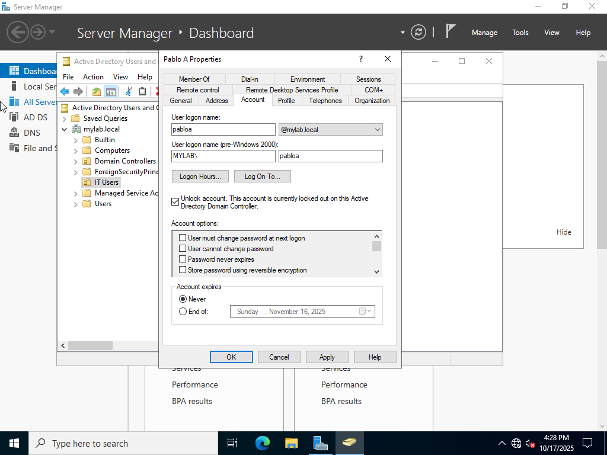
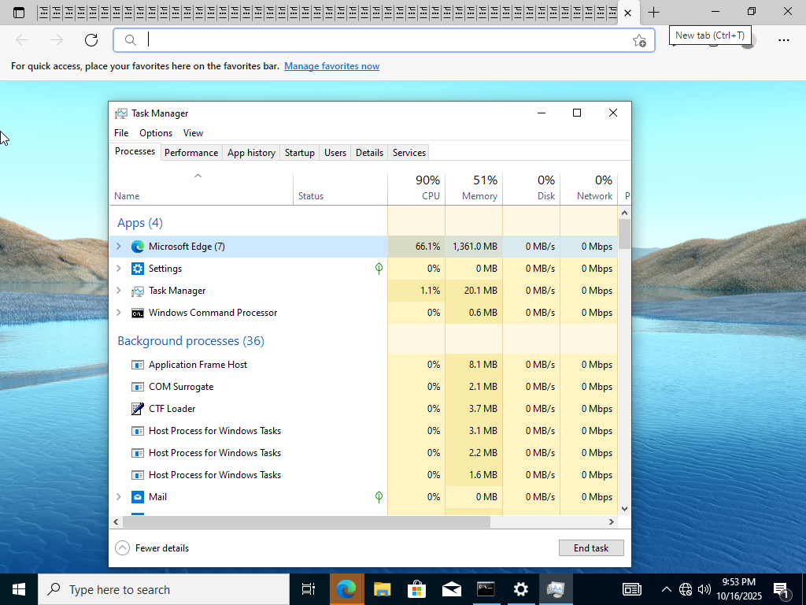

# Active-Directory-Ticketing-System-Lab
Simulated IT helpdesk project using **Active Directory**, **Group Policy**, and **ServiceNow** to document real world troubleshooting tickets such as password resets, account lockouts, setting changes, and folder access permissions in a Windows Server lab environment.

## Services used
- **Active Directory**
- **ServiceNow Ticketing System**
- **Remote Desktop Protocol (RDP)**
- **DNS & DHCP**
---
## Topology
- **Windows Server 2022 (Domain Controller)**- Configured AD, DNS, DHCP, and Group Policies
- **Windows 10 Client**- Simulated end-user device connecting and troubleshooting via RDP on a host only network
---
## Process
### Windows Server
- Set up **Active Directory Domain Services** and promoted to Domain Controller
- Created an **Organizational Unit** for the IT users and users with intentional misconfigurations
- Applied **Group Policies** for password complexity, account lockout, and screen lock
- Simulated **tickets** such as password resets, access issues, and setting misconfigurations
- Documented steps and resolutions in **ServiceNow**
- Verified fixes before closing tickets
- PASSWORD POLICY AND ACCOUNT LOCKOUT PATH (group policy management> expand the forest> right click default domain policy and select edit> computer configuration> policies> windows settings> security settings> account policies> password policies)
- SCREEN LOCK POLICY PATH (create GPO in domain> edit> user configuration> administrative templates> control panel> personalization)
- ENFORCED POLICIES AFTER IN COMMAND PROMPT WITH `gpupdate /force`
  
### Windows Client
- Connected Windows Client to the Domain Controller (system settings> about> advanced system settings> computer name> change)
- Configured user accounts and misconfigurations, documenting issues and solutions
---
## Tickets in ServiceNow
**Ticket | Description | Resolution**
*********************************
- Password Reset | User forgot Password | Reset Password in ADUC
- Account Lockout | Multiple failed logins, triggering lockout policy | Unlocked in ADUC
- Slow Computer | Too many used resources | Restarted computer and closed unneccessary processes in Task Manager
- Folder Access | User cannot access folder | Modified NTFS permissions
- Printer Issue | Printer not appearing | Started printer spooler 
- Display Setting Issue | Incorrect display setting | Reset display settings
- Timezone Setting Issue | Wrong time shown | Fixed timezone in settings
- User Leaving Company | User leaving company | Disabled Account in ADUC 

## Outcome
- Practiced **helpdesk troubleshooting** workflow
- Configured **Active Directory** and **Group Policy** for enterprise-style management
- Gained hands-on experience resolving **realistic end-user tickets**
- Learned to **document and track issues** using a ticketing workflow 
---
## Screenshot Documentation

- **Screenshots above is ServiceNow Documentation**

- **Screenshots above is Windows Server Domain and Policies configuration**

- **Screenshots above is use of RDP for user troubleshooting tickets**

- **Screenshot above is working on ticket to fix NTFS file permission misconfiguration so Sally can access folder**

-- **Screenshot above is working on ticket to fix the printer spooling so users can access printer**

-- **Screenshot above is working on account lockout ticket**

-- **Screenshot above is working on account password reset ticket**

-- **Screenshot above is working on account disable ticket**

  
